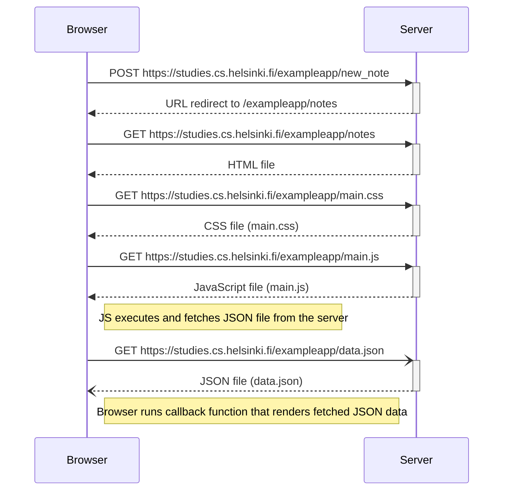

# part0 diagrams

## 0.4: New note diagram

```mermaid
sequenceDiagram;
    participant Browser;
    participant Server;
    Browser->>+Server: POST https://studies.cs.helsinki.fi/exampleapp/new_note;
    Server-->>-Browser: URL redirect to /exampleapp/notes;
    Browser->>+Server: GET https://studies.cs.helsinki.fi/exampleapp/notes;
    Server-->>-Browser: HTML file;
    Browser->>+Server: GET https://studies.cs.helsinki.fi/exampleapp/main.css;
    Server-->>-Browser: CSS file (main.css);
    Browser->>+Server: GET https://studies.cs.helsinki.fi/exampleapp/main.js;
    Server-->>-Browser: JavaScript file (main.js);
    Note right of Browser: JS executes and fetches JSON file from the server;
    Browser-)+Server: GET https://studies.cs.helsinki.fi/exampleapp/data.json;
    Server--)-Browser: JSON file (data.json);
    Note right of Browser: Browser runs callback function that renders fetched JSON data;
```